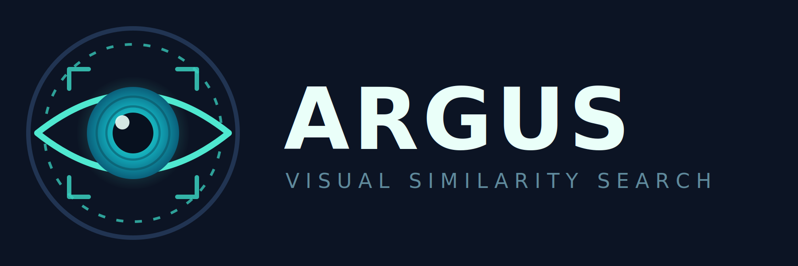

<p align="center">
  
</p>

# Argus

<p align="center">
  <a href="https://github.com/ilyin1980/Argus/actions/workflows/ci.yml"></a>
  <a href="https://github.com/ilyin1980/Argus/releases/latest"></a>
  <a href="LICENSE"></a>
  
  
  
</p>

> Argus Panoptes, the hundred-eyed giant of the myth: half his eyes stayed open
> while the rest slept, so nothing ever passed him unseen. That is the job —
> watch a whole asset library at once and say where a picture came from.

Finds images. Two related jobs, one core library, driven by both a Qt GUI and a
headless CLI so that a person and an automation script get identical results.

**Locate an asset inside a screenshot** — the main job. Grab a screenshot from a
running game, hand it over as a file or straight from the clipboard, and get back
the source `png`/`jpg` files that appear in it, each with the rectangle showing
where. Survives rescaling, background clutter, colour tinting and compression.

**Find duplicates in a folder** — the secondary job. Byte-identical copies and
near-identical variants, grouped and ranked by reclaimable space.

## Download

Ready-made, self-contained builds are on the
[releases page](https://github.com/ilyin1980/Argus/releases/latest). Unpack
anywhere and run — nothing is installed, and the model weights are inside.

| Archive | Platform | Verified on |
|---|---|---|
| `Argus-<version>-Windows-AMD64.zip` | Windows 10/11, x64 | DirectML, RTX 3050 Ti |
| `Argus-<version>-Linux-x86_64.tar.gz` | Linux x86-64, needs system Qt 6.4+ | CUDA, GTX 1050 Ti |

Run `argus doctor` first: it prints which execution providers this machine can
actually create a session on, which is not the same as which ones are listed.

macOS builds run (verified on an M1 Pro with CoreML) but are not published yet —
build from source with `tools/build.sh` until they are signed.

## Status

| Stage | State |
|---|---|
| Scanning, hashing, SQLite index, duplicate grouping | done |
| Qt GUI: thumbnail grid, clipboard paste, drag-to-select region | done |
| Neural local features (DISK) at index time, large textures indexed in tiles | done |
| Bag-of-words shortlist + LightGlue matching + RANSAC verification | done |
| GUI wiring for the search, parallel matching, cached sessions | done |
| Masked template matching, a second channel for flat UI art | done |
| DirectML, CUDA and CoreML backends, each run on real hardware | done |
| Indexing images out of other git branches, Git LFS included | done |
| Four themes, 13 interface languages, translated manual | done |
| Self-contained packages for Windows, Linux and macOS | done |
| HTTP worker mode for a remote Linux box | deferred |

Measured on a 4665-image Unity asset library: indexing about six minutes at the
shipped defaults, one search seconds rather than milliseconds — see
*Known limits*.

## Building

One script per platform. Both locate the compiler and Qt themselves, and
**download any missing dependency** before configuring.

```bash
tools\build.bat
```

```bash
tools/build.sh
```

| argument | effect |
|---|---|
| *(none)* | release build with the neural backend |
| `debug` | debug build |
| `package` | build, then assemble the self-contained `dist/` |
| `clean` | rebuild from scratch |
| `no-inference` | skip ONNX Runtime and OpenCV; duplicate finding still works |

Override discovery with `QTDIR` / `QT_PREFIX`, `ORT_ROOT` or `OPENCV_DIR`.

To fetch dependencies without building, run `tools\fetch-deps.ps1` or
`tools/fetch-deps.sh` directly.

On Linux and macOS, Qt and OpenCV come from the system package manager: the
script checks for them and prints the single command that installs them, rather
than claiming root for itself. Everything else — ONNX Runtime, the CUDA runtime
and cuDNN where a card is present, the model weights — lands in `third_party/`,
`~/argus-deps` and `models/`, none of which are in the repository.

After a Unix build, `source ~/argus-deps/env.sh` before running the
binaries, so the runtime libraries are found.

### By hand

Qt 6.4+ (Core, Gui, Sql, Widgets) and CMake 3.21. The neural backend is optional
and off by default.

```bash
cmake --preset msvc-release -DARGUS_WITH_INFERENCE=ON && cmake --build --preset msvc-release
```

That needs ONNX Runtime and OpenCV under `third_party/`, and the models under
`models/` — see *Third-party layout* below. The MSVC preset expects a Visual
Studio environment (`VC\Auxiliary\Build\vcvars64.bat`); `mingw-release` needs no
such setup.

In Qt Creator: **File → Open File or Project →** `CMakeLists.txt`.

## CLI

```bash
argus index  <dir> [--features] [--jobs N] [--ext png,jpg] [--force]
argus vocab  <dir> [--words 2048] [--sample 120000]
argus find   <dir> --image shot.png [--roi x,y,w,h] [--shortlist 200] [--top 10]
argus dupes  <dir> [--distance 4] [--exact-only] [--near-only]
argus query  <dir> --image ref.png [--top 20]
argus match  --query q.png --asset a.png
argus stats  <dir>
argus doctor [--model m.onnx] [--extract img.png]
argus formats
```

Every command takes `--db <path>` to put the index somewhere other than
`<dir>/.argus`.

Output contract, which scripts and coding agents can rely on:

- `--json` writes **newline-delimited JSON to stdout**, one object per line;
  every result carries both `rel` (relative to the indexed root) and `path`
  (absolute);
- `--paths` writes bare absolute paths instead, one per line, for piping — in
  `dupes` a blank line separates groups. It implies `--quiet` so nothing else
  reaches stdout, and combining it with `--json` is an error;
- progress, warnings and errors always go to **stderr**, never stdout;
- results come out in a deterministic order;
- exit codes: `0` found something, `1` found nothing, `2` error.

```bash
argus find D:/game/Assets --db D:/indexes/game/index.db --image shot.png --paths | clip
```

### Typical session

```bash
argus index D:/game/Assets --db D:/indexes/game/index.db --features
```

```bash
argus vocab D:/game/Assets --db D:/indexes/game/index.db
```

```bash
argus find D:/game/Assets --db D:/indexes/game/index.db --image shot.png --json
```

Indexing is incremental: a file is re-read only when its size or mtime changed.
`vocab` needs re-running after a large batch of new assets, not after every one.

## GUI

```bash
argus-gui [dir] [--index <dir>]
```

**Images:** picks the folder to search; **Index in:** picks where the database,
previews and descriptors are kept — point it away from the image folder to leave
a read-only share or someone else's repository untouched. `--index` sets the
same thing from the command line.

Press **Index**, then either **Find duplicates**, or switch to *Find by example*,
paste a screenshot with **Ctrl+V** (works from either tab), and drag a box around
the object you are looking for.

Every result shows its file name and dimensions, with a small copy glyph beside
the name that puts the **full path** on the clipboard. The bar along the bottom
shows the full path of the current selection and copies every selected path at
once, one per line.

## Packaging

```bash
cmake --install build/msvc-release
```

Assembles a self-contained folder in `dist/`: both executables, the Qt runtime
and plugins, ONNX Runtime, DirectML, OpenCV, the MSVC runtime libraries and the
models. Nothing needs installing on the target machine and nothing is read from
`PATH`.

```bash
cpack --config build/msvc-release/CPackConfig.cmake
```

Produces `Argus-<version>-<system>-<arch>.zip` — about 126 MB compressed,
227 MB unpacked.

`-DARGUS_PACKAGE_MODELS=OFF` leaves the 70 MB of ONNX weights out, for
builds that ship them separately.

### Not statically linked, and why

ONNX Runtime with DirectML is distributed as a DLL only — its import library is
3 KB — and `DirectML.dll` is a Microsoft redistributable that cannot be linked
into an executable at all. A single-file build is therefore impossible for the
neural path. What the package guarantees instead is that every dependency sits
beside the executables, so the folder runs on a machine with no Qt, no OpenCV
and no runtime installed. That is verified by running the packaged binaries with
`PATH` reduced to `C:\Windows\system32`.

### macOS and Linux

The CMake rules are cross-platform and `macdeployqt` is picked up the same way
`windeployqt` is. Both packages have been built and run on real hardware.

Two things that platform work settled, and that the packages depend on:

- **The accelerator is chosen per platform** — DirectML on Windows, CUDA on
  Linux, CoreML on macOS, each falling back to the CPU provider quietly. The
  choice lives in one place, `core/OnnxProvider.cpp`.
- **The matcher model is chosen by measurement, not by rule of thumb.** The
  fp16 export is faster only on DirectML. On CUDA the full-precision export is
  almost four times faster, on CoreML the fp16 one returns zero matches without
  raising an error, and on CPU it does not run at all — ONNX Runtime has no CPU
  kernel for its packed-QKV attention. `preferredMatcherModel()` picks; both
  models are therefore in every package.

The Linux archive deliberately does not bundle Qt: a bundled Qt would have to
match the distribution's own libraries down to the C++ ABI. Install
`qt6-base-dev` and `libqt6sql6-sqlite` (or the equivalent) first.

## Third-party layout

Nothing is installed system-wide.

```
third_party/onnxruntime/{include,lib,bin}   ONNX Runtime 1.24.4 + DirectML 1.15.4
third_party/opencv/                          OpenCV 4.14.0, prebuilt
models/disk.onnx                             DISK local-feature extractor
models/disk_lightglue_fused_fp16.onnx        LightGlue matcher
```

All Apache-2.0 or MIT. SuperPoint is deliberately absent: its weights carry a
non-commercial licence.

`argus doctor` reports what the backend can actually do, including whether
DirectML works on the installed driver, and prints each model's tensor signature.

## How the search works

1. **Extract** local features from the query once. Local, not global: on a
   screenshot the object of interest is a few percent of the frame, so any
   whole-image fingerprint or embedding compares mostly clutter.
2. **Shortlist** with a bag-of-words index over the visual vocabulary —
   microseconds for thousands of images. This is a recall filter; its scores do
   not rank usefully and are not used for ranking.
3. **Match and verify** only the shortlist: LightGlue for correspondences, then
   a RANSAC homography. Inliers score the match, and the asset's own rectangle
   projected through the homography is the rectangle shown to the user. A
   homography covers anisotropic scaling, so a nine-sliced UI element stretched
   in one axis still verifies.

Results are ranked by `inlierRatio × min(1, inliers / 50)`. Ratio leads because
raw inlier counts favour large busy images: in testing, a lookalike produced 140
inliers at 89% while the true source produced 123 at 98%.

## Known limits

- **A search costs seconds, not milliseconds** — on the order of 18 s against
  4500 assets at the shipped defaults, most of it LightGlue over the shortlist.
  The shortlist cannot simply be shrunk on a whole frame: the correct answer is
  not near the top of the bag-of-words ranking, so cutting the list drops it
  silently. **Drawing a box around the object is both the speed-up and the
  accuracy fix** — a cropped query spends its whole keypoint budget on the
  object instead of the background, which is why the GUI shortens the shortlist
  by itself once a region is selected.
- **Different artwork of the same character verifies too.** Ranking separates it
  reliably, a yes/no threshold does not, which is why results are a ranked list.
- **Perceptual hashing (`dupes`, `query`) answers "is this the same picture"**,
  never "is this a similar subject". A character drawn with several expressions
  groups together at any usable radius.
- Near-duplicate groups mean *review these*, not *delete these*. Only exact
  groups are safe to act on automatically.

## Documentation

The manuals ship inside the binary — **F1** in the GUI, `Help → Command line and
automation` for the scripting side — and their sources are in the repository:

| Document | Source |
|---|---|
| Using Argus, from indexing to reading the results | [`src/gui/help/user-guide.md`](src/gui/help/user-guide.md) |
| Command line and automation | [`src/gui/help/cli-reference.md`](src/gui/help/cli-reference.md) |
| How the pieces fit together, front page of the API reference | [`docs/mainpage.md`](docs/mainpage.md) |
| Working on the project | [`CONTRIBUTING.md`](CONTRIBUTING.md) |
| What changed and when | [`CHANGELOG.md`](CHANGELOG.md) |

Both manuals exist in all 13 interface languages beside the English ones
(`user-guide.uk.md`, `cli-reference.ja.md`, and so on). The interface itself
switches language at runtime under **View → Language**; adding one is described
in `CONTRIBUTING.md`.

## API documentation

Every declaration in the codebase carries a Doxygen comment, and the reference
is generated from them:

```
cmake --build build/<preset> --target docs   # writes build/<preset>/doc/html
tools/docs.ps1                               # Windows, fetches Doxygen if needed
tools/docs.sh                                # Linux and macOS
```

The generated pages are build output and are not committed: 7 MB of HTML that
changes with every edit belongs in a build directory, not in history. The
Doxyfile is configured to warn about any undocumented entity or parameter, and
the tree currently generates **zero warnings** — treat a new one as a defect.

`docs/mainpage.md` is the front page of the reference and the shortest map of
how the pieces fit together.

## Design notes

- Paths are stored **relative to the indexed root**, so an index built on one
  machine stays valid where the same storage is mounted elsewhere.
- Transparent pixels are flattened onto a fixed neutral grey before hashing, and
  keypoints landing on transparent areas are discarded: a sprite must not depend
  on what happened to be behind it.
- Descriptors live in flat append-only files in half precision, with SQLite
  holding only the offsets. Whole rows are always read together, so SQLite blobs
  would churn the page cache for nothing.
- Degenerate hash buckets are skipped above `--bucket-limit` and the count is
  reported, never silently dropped.

## Licence

Apache-2.0 — see [`LICENSE`](LICENSE).

The third-party components that ship inside a release archive, and the terms
each one carries, are listed in [`NOTICE`](NOTICE): Qt under LGPL-3.0 and
dynamically linked so it can be replaced, OpenCV and the DISK and LightGlue
weights under Apache-2.0, ONNX Runtime under MIT, DirectML as a Microsoft
redistributable.

SuperPoint would be the obvious alternative feature extractor and is
deliberately absent: its weights are licensed for non-commercial research only.
Because the matcher export here is fused with DISK, the two cannot be swapped
by accident — the licence position follows from a technical decision rather
than from a promise to be careful.
